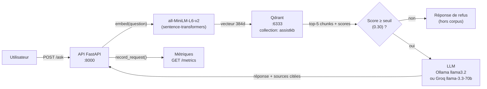

# AssistKB Search — Projet A

Système de recherche documentaire basé sur un pipeline **RAG** (Retrieval-Augmented Generation).  
L'utilisateur pose une question en langage naturel, le système recherche les passages pertinents dans un corpus de documents et génère une réponse citée, sans hallucination.

**Projet :** A — AssistKB Search (vector store Qdrant)

**Équipe :** RAGUIN Hugo · TALEB Amine

| Rôle | Membre | Fichiers |
|------|--------|----------|
| R1 — Data / Ingestion | Amine Taleb | `app/ingest.py` |
| R2 — Embeddings / Index | Amine Taleb | `app/embed.py`, `app/store.py` |
| R3 — Retrieval / LLM | Hugo Raguin | `app/retrieve.py`, `app/generate.py`, `app/api.py` |
| R4 — DevOps / Observabilité | Hugo Raguin | `docker-compose.yml`, `app/metrics.py`, `.github/` |

---

## Architecture



| Service | Image | Port | Rôle |
|---------|-------|------|------|
| `api` | Python 3.11 + FastAPI | 8000 | Interface web `/`, endpoints `/ask`, `/metrics`, `/health` |
| `qdrant` | qdrant/qdrant:v1.9.2 | 6333 / 6334 | Vector store |
| `ollama` | ollama/ollama | 11434 | LLM local (llama3.2) |

---

## Prérequis

- [Docker Desktop](https://www.docker.com/products/docker-desktop/) installé et démarré
- ~5 GB d'espace disque (image Ollama + modèle llama3.2 ~2 GB)
- Aucune clé API requise — tout tourne en local

---

## Démarrage rapide

```bash
# 1. Cloner le dépôt
git clone https://github.com/theohugo/tp-equipe-1j.git
cd tp-equipe-1j

# 2. Copier la configuration
cp .env.example .env

# 3. Lancer tout le pipeline (une seule commande)
docker compose up --build
```

**C'est tout.** Le `docker compose up` enchaîne automatiquement :

1. Démarrage de Qdrant (vector store)
2. Démarrage d'Ollama + téléchargement du modèle `llama3.2` si absent (~2 GB, première fois uniquement)
3. Ingestion du corpus → `corpus/chunks.jsonl` (sauté si déjà présent)
4. Vectorisation et indexation dans Qdrant (sauté si collection déjà peuplée)
5. Démarrage de l'API FastAPI sur le port 8000

Attendre que les logs affichent :
```
[ollama] Modele pret.
[start] Demarrage de l'API...
INFO: Uvicorn running on http://0.0.0.0:8000
```

---

## Utilisation

### Interface web (recommandé)

Ouvrir [http://localhost:8000](http://localhost:8000) dans le navigateur.

L'interface permet de poser des questions en langage naturel et d'afficher les réponses avec leurs sources, la latence et le nombre de tokens — sans curl ni Swagger.

### Swagger UI

Ouvrir [http://localhost:8000/docs](http://localhost:8000/docs) dans le navigateur pour explorer l'API REST.

### Via curl

```bash
# Poser une question
curl -X POST http://localhost:8000/ask \
  -H "Content-Type: application/json" \
  -d '{"question": "Qu'\''est-ce que Qdrant et comment fonctionne-t-il ?"}'

# Santé de l'API
curl http://localhost:8000/health

# Métriques (après plusieurs requêtes)
curl http://localhost:8000/metrics
```

### Exemples de questions

**Dans le corpus — doit répondre avec citations :**
- "Qu'est-ce que Qdrant et comment fonctionne-t-il ?"
- "Quelles mesures RGPD sont recommandées pour les données personnelles ?"
- "Qu'est-ce qu'une recherche vectorielle hybride ?"
- "Quel incident de latence a été observé en mars 2026 ?"
- "Quelle est l'architecture d'AssistKB ?"

**Hors corpus — doit répondre "Je ne dispose pas de cette information" :**
- "Quelle est la capitale du Venezuela ?"
- "Quel est le chiffre d'affaires 2025 de Google ?"

---

## Structure du projet

```
tp-equipe-1j/
├── app/
│   ├── config.py        # Settings centralisés (pydantic-settings + .env)
│   ├── ingest.py        # R1 — Lecture corpus, chunking (PDF, HTML, TXT)
│   ├── embed.py         # R2 — Vectorisation + upsert dans Qdrant
│   ├── store.py         # Abstraction QdrantStore (init, upsert, search)
│   ├── retrieve.py      # R3 — Encode la question, top-k, seuil de refus
│   ├── generate.py      # R3 — Appel LLM (Ollama / Groq / Gemini)
│   ├── api.py           # R3 — Endpoints FastAPI (+ route GET / pour l'UI)
│   └── metrics.py       # R4 — Collecte latence, scores, tokens, coût
├── static/
│   └── index.html       # Interface web de chat (HTML/CSS/JS, auto-contenu)
├── corpus/
│   ├── seed/            # Documents sources (HTML)
│   └── chunks.jsonl     # Généré automatiquement par ingest.py
├── scripts/
│   ├── start.sh         # Entrypoint API : ingest → embed → uvicorn
│   └── ollama-start.sh  # Entrypoint Ollama : serve → pull llama3.2
├── docker-compose.yml   # Orchestration des 3 services
├── Dockerfile           # Image Python 3.11 pour l'API
├── requirements.txt     # Dépendances Python
└── .env                 # Configuration locale (ne pas committer)
```

---

## Configuration

Toutes les variables sont dans `.env` :

| Variable | Défaut | Description |
|----------|--------|-------------|
| `LLM_PROVIDER` | `ollama` | Fournisseur LLM : `ollama`, `groq`, `gemini` |
| `LLM_MODEL` | `llama3.2` | Modèle utilisé (`llama3.2:1b` pour plus de vitesse) |
| `OLLAMA_HOST` | `http://ollama:11434` | URL du serveur Ollama |
| `QDRANT_HOST` | `qdrant` | Hostname Qdrant |
| `QDRANT_COLLECTION` | `assistkb` | Nom de la collection vectorielle |
| `EMBED_MODEL` | `all-MiniLM-L6-v2` | Modèle d'embeddings local |
| `EMBED_DIM` | `384` | Dimension des vecteurs |
| `CHUNK_SIZE` | `800` | Taille des chunks en caractères |
| `CHUNK_OVERLAP` | `120` | Chevauchement entre chunks |
| `TOP_K` | `5` | Nombre de chunks récupérés par requête |
| `SIMILARITY_THRESHOLD` | `0.30` | Score minimum pour ne pas refuser (voir tableau ci-dessous) |

### Choix du seuil de similarité

Le `SIMILARITY_THRESHOLD` est le paramètre clé de l'anti-hallucination. Si le meilleur chunk retourné par Qdrant obtient un score inférieur à ce seuil, le système refuse de répondre plutôt que de risquer d'inventer.

Nous avons retenu **0.30** comme valeur d'équilibre : suffisamment bas pour accepter les questions légitimement couvertes par le corpus, suffisamment haut pour bloquer les questions hors-sujet avant qu'elles n'atteignent le LLM.

| Seuil | Comportement |
|-------|-------------|
| `0.50+` | Très restrictif — refuse beaucoup, mais les réponses données sont très fiables |
| **`0.30`** | **Equilibré — valeur retenue dans ce projet** |
| `0.20` | Permissif — répond plus souvent, plus de risque de hors-sujet |
| `0.10` | Répond à presque tout avec des chunks non pertinents → hallucinations garanties |

### Utiliser Groq à la place d'Ollama

```env
LLM_PROVIDER=groq
LLM_MODEL=llama-3.3-70b-versatile
GROQ_API_KEY=gsk_...
```

---

## Pipeline détaillé

### R1 — Ingestion (`app/ingest.py`)

Lit tous les fichiers de `corpus/seed/` et `corpus/raw/`, extrait le texte brut (PDF via `pdfplumber`, HTML via `selectolax` avec suppression CSS/JS, TXT natif), découpe en chunks de 800 caractères avec un overlap de 120 et sauvegarde dans `corpus/chunks.jsonl`.

### R2 — Indexation (`app/embed.py`)

Charge le modèle `all-MiniLM-L6-v2` localement, vectorise les chunks par batch de 64, normalise les vecteurs (cosinus), et les upsert dans la collection Qdrant avec les métadonnées (source, chunk_index, texte).

### R3 — Retrieval + Génération (`app/retrieve.py`, `app/generate.py`)

Encode la question avec le même modèle d'embeddings, interroge Qdrant pour les 5 chunks les plus proches. Si le score du meilleur chunk est inférieur à 0.30, la requête est refusée sans appel LLM. Sinon, le contexte est envoyé au LLM avec un prompt strict interdisant les réponses hors contexte.

### R4 — Observabilité (`app/metrics.py`)

Chaque requête `/ask` enregistre en mémoire : score de similarité, latence, tokens consommés, refus ou non. L'endpoint `GET /metrics` retourne un rapport avec p50/p95 de latence, taux de refus, coût projeté.

---

## Commandes utiles

```bash
# Arrêter les services (conserve les volumes)
docker compose down

# Arrêter ET supprimer les volumes (reset complet, re-télécharge le modèle)
docker compose down -v

# Rebuild l'image API après modification du code
docker compose up --build

# Voir les logs en temps réel
docker compose logs -f api
docker compose logs -f ollama

# Vérifier l'état des services
docker compose ps
```

---

## Corpus

Le corpus `corpus/seed/` contient 7 documents fournis dans le cadre du TP :

| Fichier | Contenu |
|---------|---------|
| `fiche_outil_qdrant.html` | Présentation et fonctionnement de Qdrant |
| `archi_assistkb_v0.html` | Architecture du système AssistKB |
| `incident_2026-03_latence-rag.html` | Rapport d'incident latence RAG |
| `incident_2026-02_hallucination.html` | Rapport d'incident hallucination LLM |
| `rex_mission_banque-alpha.html` | Retour d'expérience mission Banque Alpha |
| `rgpd_anonymisation_corpus.html` | Guide RGPD anonymisation corpus |
| `README.html` | Introduction au corpus |

---

## Stack technique

| Composant | Technologie | Version |
|-----------|------------|---------|
| API | FastAPI + Uvicorn | 0.111.0 / 0.30.1 |
| Embeddings | sentence-transformers | 3.0.1 |
| Vector store | Qdrant | 1.9.1 |
| LLM local | Ollama + llama3.2 | latest |
| Ingestion PDF | pdfplumber | 0.11.0 |
| Ingestion HTML | selectolax | 0.3.21 |
| Chunking | langchain-text-splitters | 0.2.0 |
| Config | pydantic-settings | 2.3.4 |
| Conteneurisation | Docker Compose | v2 |
